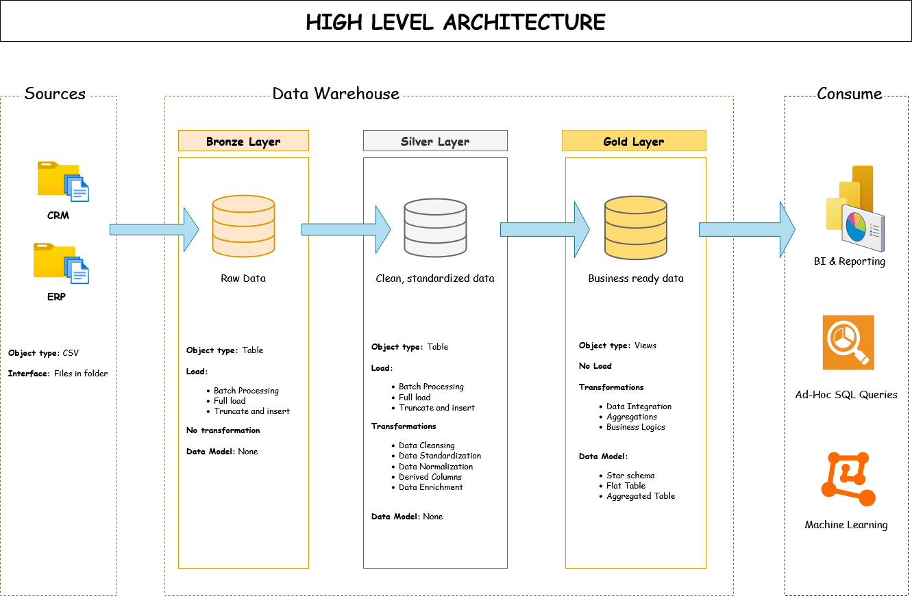

# 📊 Data Warehouse and Analytics Project (SQL Server – Medallion Architecture)

A full-cycle **Data Engineering and Analytics portfolio project** showcasing the design, implementation, and validation of a modern data warehouse using SQL Server. The project simulates an enterprise-grade pipeline using **Medallion Architecture (Bronze → Silver → Gold)** and demonstrates core skills in **ETL, data modeling, quality checks, and reporting**.

---

## 🚀 Key Highlights

- ✅ Built using **Microsoft SQL Server** following scalable data warehousing best practices.
- ✅ Implemented **ETL pipelines** to ingest, cleanse, and transform raw ERP and CRM datasets.
- ✅ Designed **star schema models** and created **analytical views** ready for BI consumption.
- ✅ Integrated **data quality validation scripts** to ensure trust and integrity.
- ✅ Fully documented, modular, and ideal for showcasing real-world skills to recruiters.

---

## 🧱 Data Architecture: Medallion Pattern

This project implements the **Medallion Architecture** with three progressive layers:

| Layer  | Purpose             | Contents                              |
|--------|---------------------|---------------------------------------|
| 🥉 Bronze | Raw staging layer    | Data loaded directly from CSVs         |
| 🥈 Silver | Cleaned data layer   | Standardized, deduplicated tables      |
| 🥇 Gold   | Business-ready layer | Fact & dimension views in star schema |

---

## 📘 Project Modules

### 🔹 1. Bronze Layer – Raw Data Ingestion
- Loads raw data from CSVs using `BULK INSERT`.
- Stored as-is in staging tables.
- Adds `dwh_create_date` to track ETL timestamps.

### 🔸 2. Silver Layer – Data Transformation
- Truncates and reloads silver tables with clean, typed data.
- Handles nulls, standardizes fields, and maps codes to friendly values.
- Uses stored procedures for modular transformation.

### ⭐ 3. Gold Layer – Analytical Modeling
- Creates dimension and fact views for BI tools.
- Joins and aggregates silver data into a star schema.
- Optimized for analytics and reporting use cases.

---

## ✅ Data Quality Checks

Robust quality checks are implemented in both silver and gold layers:

- Check for nulls or duplicate keys
- Validate date ranges and data types
- Enforce referential integrity (e.g. FK → PK)
- Ensure data standardization (e.g. trimmed strings, value mappings)

---

## 📊 Insights Enabled

- 📈 Customer behavior analysis
- 🛒 Product performance insights
- 💰 Sales trend reports
- 🔍 Business metrics for strategic decisions

---

## 🧪 Tools & Technologies

| Category         | Stack                                               |
|------------------|-----------------------------------------------------|
| Database         | Microsoft SQL Server                                |
| ETL              | T-SQL, Stored Procedures, BULK INSERT               |
| Modeling         | Star Schema, Medallion Architecture                 |
| Quality Checks   | Manual & Scripted SQL Tests                         |
| Diagramming      | Draw.io (Architecture & Data Flow)                 |
| Docs & Planning  | Notion, Markdown                                    |
| Version Control  | Git & GitHub                                        |

---

## 📂 Repository Structure

data-warehouse-project/
│
├── datasets/                           # Raw datasets used for the project (ERP and CRM data)
│
├── docs/                               # Project documentation and architecture details
│   ├── etl.drawio                      # Draw.io file shows all different techniquies and methods of ETL
│   ├── data_architecture.drawio        # Draw.io file shows the project's architecture
│   ├── data_catalog.md                 # Catalog of datasets, including field descriptions and metadata
│   ├── data_flow.drawio                # Draw.io file for the data flow diagram
│   ├── data_models.drawio              # Draw.io file for data models (star schema)
│   ├── naming-conventions.md           # Consistent naming guidelines for tables, columns, and files
│
├── scripts/                            # SQL scripts for ETL and transformations
│   ├── bronze/                         # Scripts for extracting and loading raw data
│   ├── silver/                         # Scripts for cleaning and transforming data
│   ├── gold/                           # Scripts for creating analytical models
│
├── tests/                              # Test scripts and quality files
│
├── README.md                           # Project overview and instructions
├── LICENSE                             # License information for the repository
├── .gitignore                          # Files and directories to be ignored by Git
└── requirements.txt                    # Dependencies and requirements for the project

## 🧠 What I Learned

  -End-to-end design of a modern SQL-based data warehouse
  -Applying Medallion architecture to real-world scenarios
  -Writing reusable, production-level SQL stored procedures
  -Building audit-friendly ETL pipelines using timestamps and quality checks
  -Documenting and structuring data projects for team handoff or GitHub showcasing
